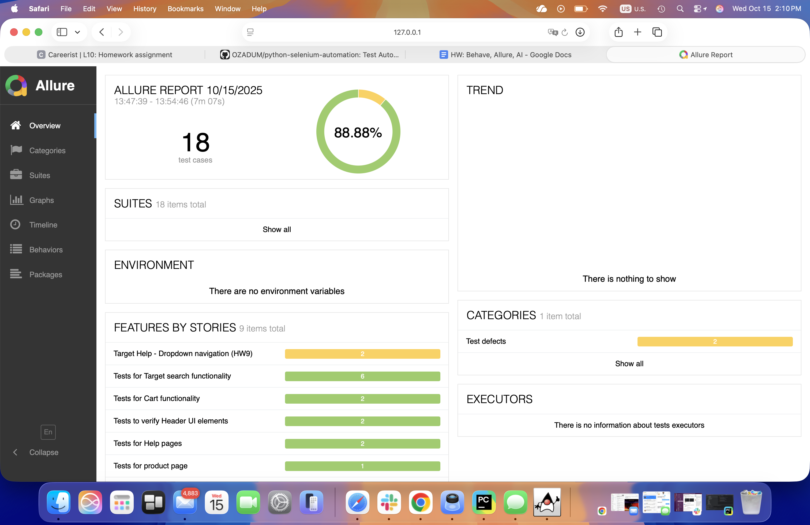
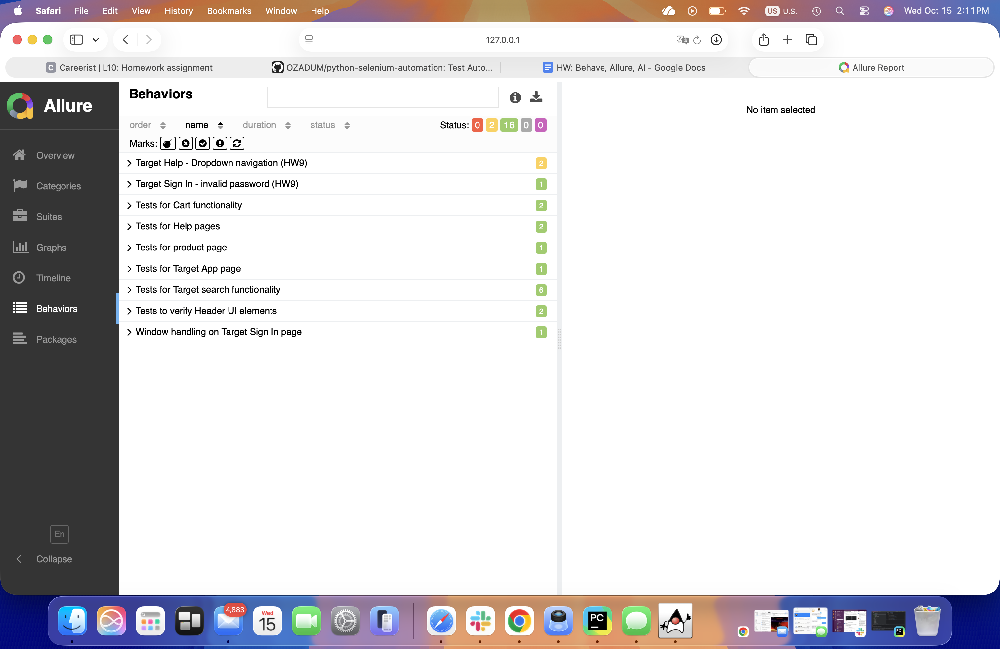
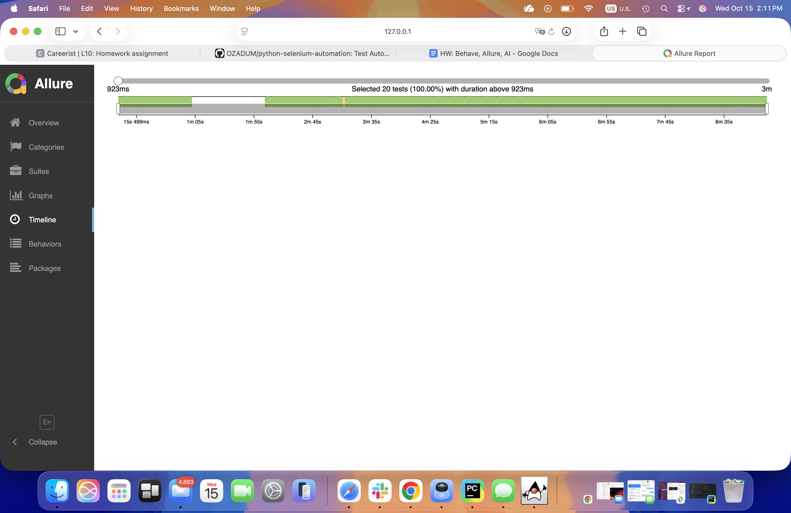

---

## 🖼 Allure Report Screenshots

### 🟢 Overview


### 📊 Behaviors


### ⏱ Timeline


> All tests passed successfully — HW10 complete ✅
# 🧪 Homework 10 — Behave + Allure Integration

## 🎯 Objective
Integrate **Allure reporting** with the existing Behave automation framework to visualize test execution results, track feature stability, and provide a clear overview of project quality metrics.

---

## ⚙️ Environment Setup

**OS:** macOS  
**Python Version:** 3.12  
**Frameworks:**  
- `Behave` (BDD testing)
- `Allure` (test reporting)
- `Selenium WebDriver`

**Installed Packages:**
```bash
pip install behave
pip install allure-behave
pip install selenium
